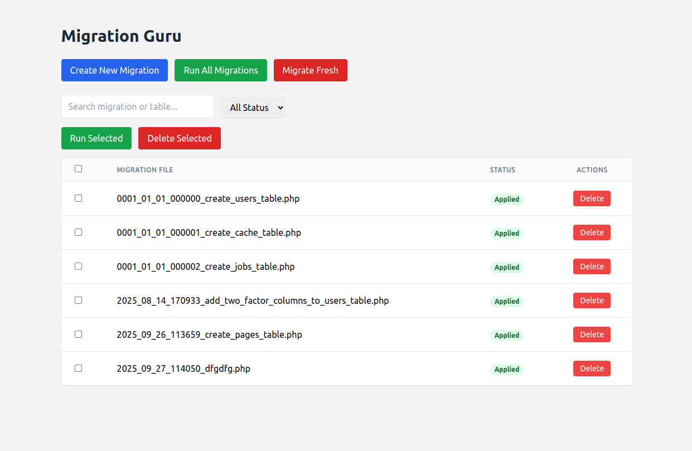
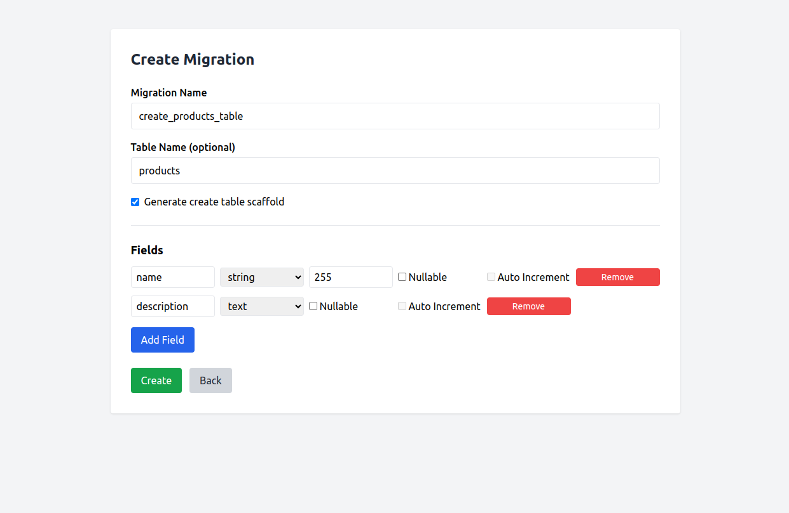
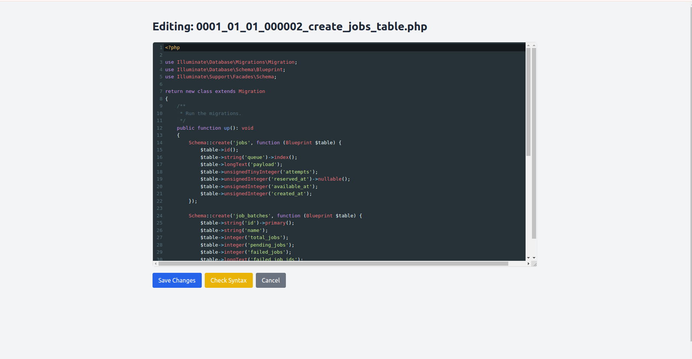
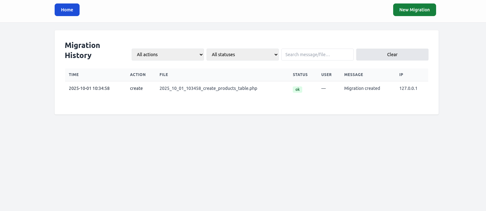

# Migration Guru

A Laravel 12 package to manage migrations from a simple **web UI**.  
It allows you to create,edit, run, rollback, and delete migrations without touching the terminal.

**Also for Laravel 10 & 11 versions.

---

## 📸 Screenshots

### Dashboard


### Create Migration


### Edit Migration


### History Migration logs


---

## 📦 Installation

Require the package via Composer:

```bash
composer require nikelioum/migration-guru
```

---

Laravel will auto-discover the service provider.

## Publish
Publish config and views:

```bash
php artisan vendor:publish --tag=migration-guru
```

🚀 Usage

Once installed, visit the following routes in your browser:

Dashboard (list migrations):
/migration-guru

Create new migration:
/migration-guru/create

Edit migration:
Click the Edit button in the dashboard to open an online IDE with syntax highlighting and live PHP validation.

Run a migration:
Trigger from the UI (button inside dashboard).

Rollback / Delete:
Trigger from the UI (buttons inside dashboard).

✨ Features

Web UI to manage migrations

Create migration scaffolds with fields

Run single or bulk migrations

Rollback or delete migrations

Supports auto-increment, nullable, varchar length, etc.

🔖 Versioning

The package follows Semantic Versioning
.
For example:

v1.0.0 – first stable release

v1.0.1 – bug fixes

v1.1.0 – new features